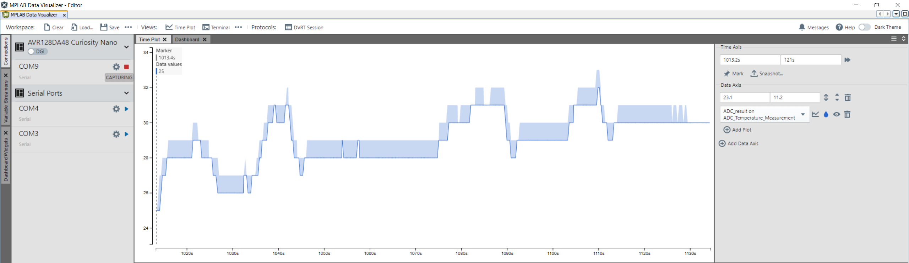
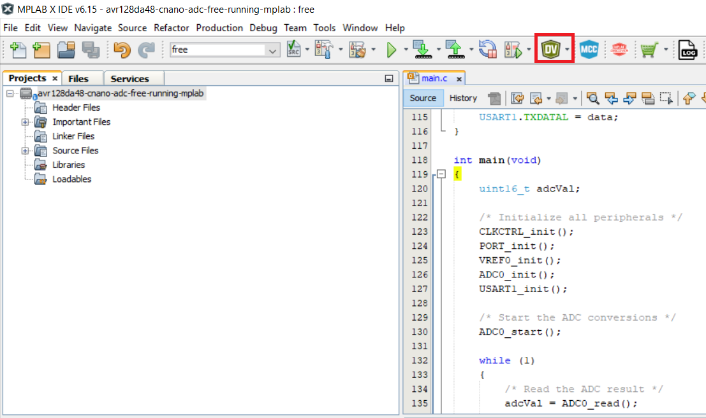
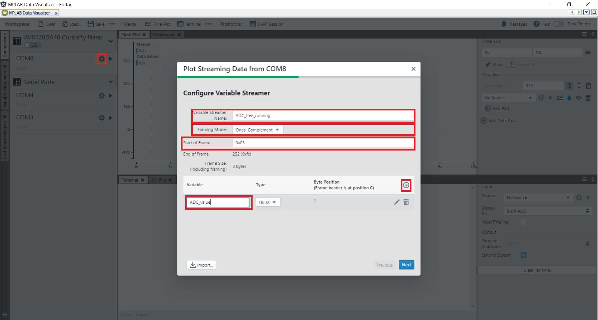
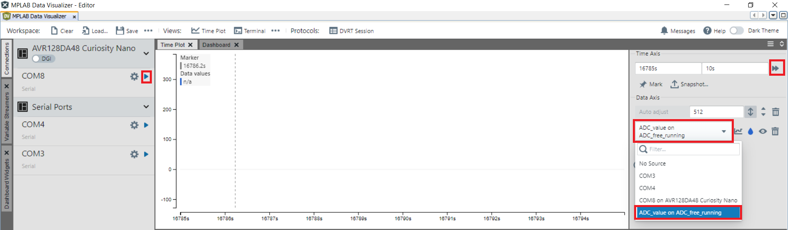
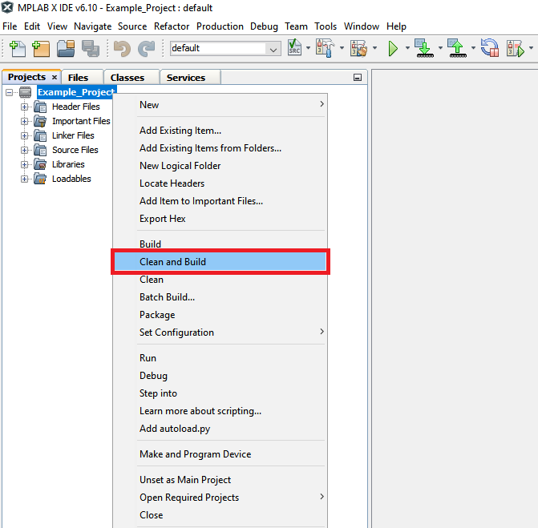
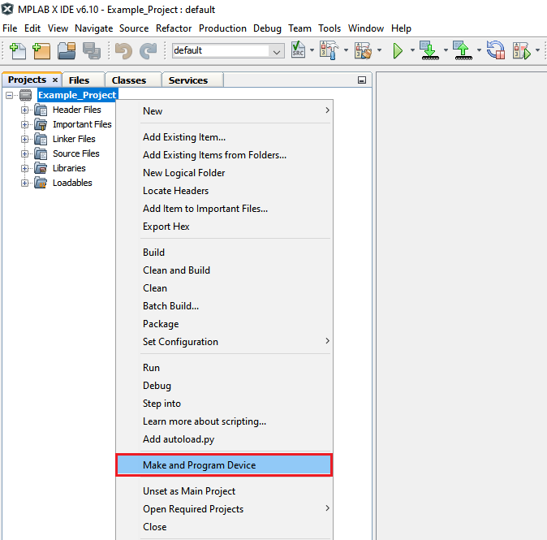

<!-- Please do not change this html logo with link -->

<a href="https://www.microchip.com" rel="nofollow"></a>

# Analog-to-Digital Converter (ADC) - Temperature Measurement Using AVR128DA48 Microcontroller

## Objective

In this application, the ADC will be used to measure the temperature using the on-board specific sensor, and the results will be transmitted through Universal Synchronous/Asynchronous Receiver/Transmitter (USART). The software's example code diagram is presented in the figure below.

## Related Documentation

More details and code examples on the AVR128DA48 can be found at the following links:

- [AVR128DA48 Product Page](https://www.microchip.com/wwwproducts/en/AVR128DA48)
- [AVR128DA48 Code Examples on GitHub](https://github.com/microchip-pic-avr-examples?q=avr128da48)
- [Using 12-Bit ADC for Conversions, Accumulation, and Triggering Events](https://www.microchip.com/wwwappnotes/appnotes.aspx?appnote=en1001530)

## Software Used

- [MPLAB® X IDE](http://www.microchip.com/mplab/mplab-x-ide) v6.15 or newer
- [MPLAB® XC8](http://www.microchip.com/mplab/compilers) v2.45 or newer
- [AVR-Dx Series Device Pack](https://packs.download.microchip.com/) v2.3.272 or newer
- [MPLAB® Data Visualizer](https://www.microchip.com/en-us/tools-resources/debug/mplab-data-visualizer)

## Hardware Used

- [AVR128DA48 Curiosity Nano Development board](https://www.microchip.com/en-us/development-tool/DM164151) is used as a test platform.
<br>

## Operation

To program the Curiosity Nano board with this MPLAB X project, follow the steps provided in the [How to Program the Curiosity Nano Board](#how-to-program-the-curiosity-nano-board) chapter.<br><br>

## Setup

The AVR128DA48 Curiosity Nano Development Board is used as the test platform. The internal temperature sensor is used for measurements as input of the ADC.

<br>The following configurations must be made:

|Pin           | Configuration      |
| :----------: | :----------------: |
|PC0 (TX)      | Digital Output     |

## Demo

After alternatively cooling and warming up the microcontroller, the converted sensor's temperature from the ADC result will be plotted on the graph from Data Visualizer plugin, as in below picture. Follow the steps in the **[How to use MPLAB Data Visualizer](#how-to-use-mplab-data-visualizer)** section to set up the Data Visualizer so that it can correctly view the plotted values through USART.

<br>

**Note:** The plotted variable called ```ADC_value``` must be configured as ```int16``` type.

## Summary 

This application showcases a basic example of how to measure the temperature using the ADC on the AVR-DA devices. 

## How to use MPLAB Data Visualizer

This section illustrates how to use the MPLAB X Data Visualizer to send commands and receive information, but prior to programming the AVR128DA48 Curiosity Nano Board. This can be applied to any other projects.

1. Open the software terminal in MPLAB X IDE. Click on the **Data Visualizer** button.

<br>

2. Prepare the settings in Data Visualizer.
- Click on the specific serial port communication **COMx**
- Set the correct **Baud Rate**
- In the **Connections** tab, at the **COMx** option, press **New variable streamer...**
- Type a specific **Variable Streamer Name**
- Choose **Ones' Complement** from the **Framing Mode** dropdown menu
- Type a specific value from the **Start of Frame**, press **Add a variable**
- Type a specific name for the variable name in **Variable Name**
- Press **Next**, after that press **Next** again
- Optional: Save these settings as a json file by pressing **Save as**

<br>

3. See the expected result on Data Visualizer.
- Select **Source** from Time Plot window
- Click **Start Streaming COMx** the communication serial port
- Click **Scroll axis automatically**.

<br>

##  How to Program the Curiosity Nano board

This chapter shows how to use the MPLAB X IDE to program an AVR® device with an Example_Project.X. This can be applied for any other projects. 

- Connect the board to the PC.

- Open the Example_Project.X project in MPLAB X IDE.

- Set the Example_Project.X project as main project.

  - Right click on the project in the **Projects** tab and click **Set as Main Project**.
    <br>

- Clean and build the Example_Project.X project.

  - Right click on the **Example_Project.X** project and select **Clean and Build**.
    <br>

- Select the **AVRxxxxx Curiosity Nano** in the Connected Hardware Tool section of the project settings:

  - Right click on the project and click **Properties**
  - Click on the arrow under the Connected Hardware Tool
  - Select the **AVRxxxxx Curiosity Nano** (click on the **SN**), click **Apply** and then click **OK**:
    <br>

- Program the project to the board.
  - Right click on the project and click **Make and Program Device**.
    <br>

<br>

- - -
## Menu
- [Back to Top](#analog-to-digital-converter-adc---temperature-measurement-using-avr128da48-microcontroller)
- [Back to Related Documentation](#related-documentation)
- [Back to Software Used](#software-used)
- [Back to Hardware Used](#hardware-used)
- [Back to Operation](#operation)
- [Back to Setup](#setup)
- [Back to Demo](#demo)
- [Back to Summary](#summary)